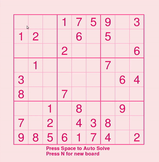

# sudoku-solver



It solves sudoku puzzles :>


## How to use

Clone repo and run this command from the working folder

```python3 sudokugame.py```


#### Requires
 
~~`requests`~~ and `pygame`

Use 
```pip install pygame ``` ~~```requests```~~

*No longer needs requests or internet*


## Terminal version with visual solving output

Run this command


```python3 solver.py <optional-time> hard```

Replace time with any number which specifies how long in seconds the output will wait at each position. Reccommended 0.05. 0 is no visual.
Add "hard" at the end if you want the very difficult grid. Remove it if you want the easy grid.

```python3 solver.py 0.05```

For no visual and hard grid, you must provide 0 as an arugment.

```python3 solver.py 0 hard```


Using a visual drastically increases the time it takes for the program to finish solving the grid. Replace the example grid with an easy
version, or use the default provided easy grid, to avoid having to wait all day to see it go all the way through.
0.05 is a good balance between visual clarity and time to solve.


# To-Do
Rewrite the whole thing with classes so there isn't so much surface redrawing ';..;'

###### Maybe
